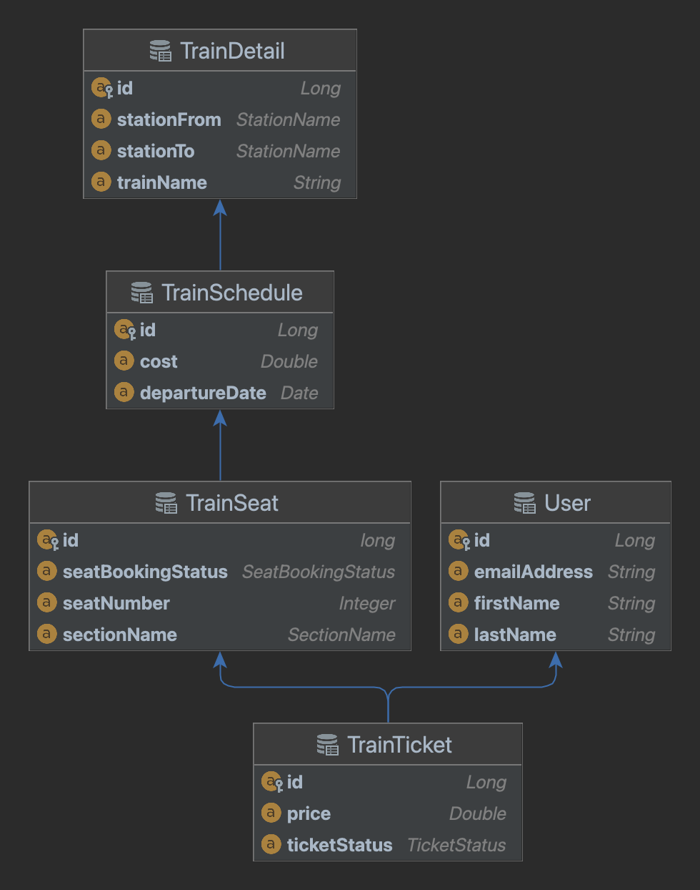

# README
This is a Java, Spring Boot Maven project that implements a simple REST API for managing a list of books. The project uses Spring Data JPA to interact with an in-memory h2 database and includes unit tests and Integration tests.

## Entities
1. TrainDetail - To store train basic details like name, source, destination
2. TrainSchedule - To store train schedule details like train id, date of departure
3. TrainSeat - To store train seat details like train schedule id, seat number, section name
4. TrainTicket - To store train ticket issues to the user
5. User - To store user details like name, email.

## ER Diagram

## API Endpoints
1. I want to board a train from London to France. The train ticket will cost $20.
Create API where you can submit a purchase for a ticket. Details included in the receipt are:
From, To, User , price paid.
User should include first and last name, email address
The user is allocated a seat in the train. Assume the train has only 2 sections, section A and section B.

Api endpoint: POST "/train-ticket"

2. An API that shows the details of the receipt for the user
Api endpoint: GET "/train-ticket/user/{id}"

3. An API that lets you view the users and seat they are allocated by the requested section
Api endpoint: GET "/train-ticket/train-schedule-id/{trainScheduleId}/section/{sectionName}"

4. An API to remove a user from the train
Api endpoint: DELETE "/train-ticket"

5. An API to modify a user's seat
Api endpoint: PUT "/train-ticket"